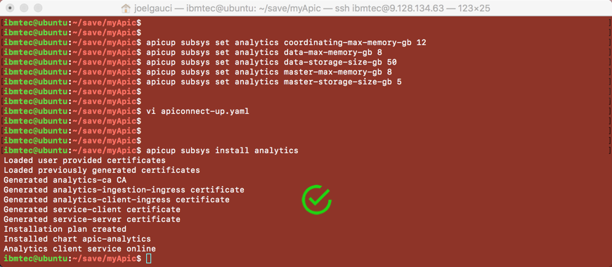

<div style="background-color:#5A0F1B;color:white; vertical-align: middle; text-align:center;font-size:190%; padding:10px; margin-top:100px">
 Installing IBM API Connect v2018
</div>

---
# Install apiconnect v2018 on Ubuntu / Kubernetes


## Goal of this material
Since March 2018, a new version of IBM API Connect (apiconnect) has been released on the market.
This version is based on microservices and is fully compliant with modern hybrid deployment patterns.
The goal of this material is to provide guidance to install apiconnect v2018 versions on a Kubernetes (k8s) cluster on top of Ubuntu.
To be precise, the installation process described in this doc is based on an Ubuntu version 16.04 LTS provided as a virtual machine (details about this VM are discussed in a dedicated chapter).
Last but not least, I do not provide guidance for production install (this will come later...) but for a **dev/demo** environment.
**The k8s cluster that we use consists in one master node only**.

Therefore, you may be interested in this guide in the following cases:
* you want to feel more comfortable with the apiconnect v2018 installation process on k8s
* you want to test capabilities of apiconnect v2018: api creation, api product life cycle management, portal customization, billing, security...and much more!
* you need to develop a prototype based on apiconnect v2018 to implement some specific solution pattern or use case: psd2 might be a good example
* you want to provide a demo or presentation to a business or technical audience
* you simply want to work with your own apiconnect instance and need to install it quickly

I hope the goals have been clearly defined. So let's discover together the **Table of Content**...

# Table of Content

Install apiconnect v2018 on Ubuntu / Kubernetes

1. Pre-requisites & installation
    - Ubuntu virtual machine
    - Docker & Kubernetes
    - Helm Chart
    - Python
    - Fake SMTP server
    - DataPower gateways
2. K8s cluster setup
3. Download images of apiconnect v2018
4. Install *apic* and *apicup* native cli tools
5. Creating a local Docker registry
6. Upload apiconnect v2018 images in your local Docker registry
7. Starting the apiconnect v2018 install
    - Manager
    - Analytics
    - Portal
    - Gateway
8. Accessing the Cloud Management Console
9. Initial settings on apiconnect v2018: Cloud Management Console
    - Email server
    - Provider organization
    - Topology: analytics and portal services
    - Topology: API gateway service
10. Initial settings on apiconnect v2018: API Manager
    - Your first catalog
    - Ready to create your first APIs...
11. Accessing the API portal
12. Conclusion (& Congratulations)

    Appendix A. Resources


# 1. Pre-requisites

This chapter introduces the pre-requisites for the different components used to install and execute apiconnect v2018.
If necessary, I provide commands that need to be executed (in order) to install or configure a specific property of the system.

In this document, the *shell prompt* is represented at the beginning of a line with the **$** symbol.
A prefix before the **$** symbol mentions the environment on which the command has to be executed:
* ubuntu: if the command has to be executed on the ubuntu virtual machine
* local: if the command has to be executed on your local workstation (mine is a MAC)
* idg: if the command has to be executed on an IBM DataPower Gateway (IDG)

Moreover, all the commands that need to be applied are presented in a console section.
Here is a very basic example of using the **echo** command on the Ubuntu VM (ubuntu) and the result in the following line:

```code
ubuntu$ echo "Hello apiconnect v2018"
Hello apiconnect v2018
```

All the commands are not fully described or commented as the focus is on installing apiconnect v2018. For any details, please use your favorite search engine to get some more information about a specific command or feel free to contact me. Note that you will also find some useful resources in the appendix.

This guide also provides some screenshots: when a result has to be checked or emphasized on one of these captures, a specific icon is used, which is the following:


## Ubuntu virtual machine
The Ubuntu virtual machine that you need to install apiconnect v2018 on top of k8s must have the following characteristics:
* Ubuntu OS version: **16.04 LTS**
* **32GB** of RAM
* **8 vCPU**
* more than 200GB of **disk size**: I have used **300GB** for the installation that is described in this guide and everything was ok on my side!
* **an internet connectivity**: the vm must be able to reach a public web site

As soon as you get such a VM, you can open a terminal window and enter the following commands:

```console
ubuntu$ sudo sysctl -w vm.max_map_count=262144
ubuntu$ sudo swapoff -a
```
K8s won't run with swap enabled. **swapoff -a** is the Ubuntu command for disabling it.

### Important
The 2 previous commands only work when the system is online.
If it is rebooted then these settings are lost and have to be re-run before k8s will start or apiconnect pods will come up.
These commands can be turned on permanently:
* by editing **/etc/fstab** and commenting out the SWAP line; here is a command you can use to perform this action:
```console
ubuntu$ sudo sed -i '/ swap / s/^/#/' /etc/fstab
```

* by editing **/etc/sysctl.conf** and adding **vm.max_map_count=262144** to the end of the file, as shown on the following picture:


## Docker & Kubernetes (k8s)
The version of Docker and k8s used to perform the apiconnect v2018 installation are:
* Docker: version 1.13.1 (client + server)
* k8s: version 1.10.0 (client) + 1.10.3 (server)

[Here](https://www.techrepublic.com/article/how-to-quickly-install-kubernetes-on-ubuntu/) is a very good article about the installation of Docker and k8s. It presents the creation of a k8s cluster with master and worker nodes.
In our case, **we only install a single master node**.

If do not want to read the, here are the commands you need to execute to first install dependencies and Docker:
```console
ubuntu$ sudo apt-get update && sudo apt-get install -y apt-transport-https
ubuntu$ sudo apt install docker.io
```

Then, when Docker installation has been completed:
```console
ubuntu$ sudo systemctl start docker
ubuntu$ sudo systemctl enable docker
```

There are different ways of installing k8s. In our case, the first step is to download and add the key for the k8s install:
```console
ubuntu$ sudo curl -s https://packages.cloud.google.com/apt/doc/apt-key.gpg | sudo apt-key add
```

Next add a repository by creating the file */etc/apt/sources.list.d/kubernetes.list* ...
```console
ubuntu$ sudo touch /etc/apt/sources.list.d/kubernetes.list
```

...and enter the following content into this specific file (using nano or vi)
```console
deb http://apt.kubernetes.io/ kubernetes-xenial main
```

Save and close that file. Install k8s with the following commands:
```console
ubuntu$ sudo apt-get update
ubuntu$ sudo apt-get install -y kubelet kubeadm kubectl kubernetes-cni
```

At this point, Docker and k8s are installed on your Ubuntu virtual machine!

## Helm Chart (& Tiller)
Helm is the package manager for k8s.
The version that I use for the apiconnect v2018 installation is 2.8.2.
Tiller, the server portion of Helm, typically runs inside of your Kubernetes cluster, we will initialize it later...
At this point, just follow the installation guide for helm that you can find [**here**](https://docs.helm.sh/using_helm/#installing-helm)

In my case, I executed the Helm install based on a [**binary release**](https://docs.helm.sh/using_helm/#from-the-binary-releases).

## Python
The version of python I use is 2.7.12.
To get this version, simply execute the **python** command from a terminal window:
```console
ubuntu$ python
Python 2.7.12 (default, Dec  4 2017, 14:50:18)
[GCC 5.4.0 20160609] on linux2
Type "help", "copyright", "credits" or "license" for more information.
>>>
```

If python is not installed on your Ubuntu VM, just execute the following commands:
```console
ubuntu$ sudo add-apt-repository ppa:deadsnakes/ppa
ubuntu$ sudo apt-get update
ubuntu$ sudo apt-get install python2.7
```

## Fake SMTP server
Once apiconnect v2018 will have been installed, you need an SMTP server to be configured from the Cloud Management Console of apiconnect.
Fake SMTP is a quick and simple solution to implement such an SMTP server.
I provide the 2.0 version of Fake SMTP in the material (cf. ./save directory) but you can also download it from [**here**](http://nilhcem.com/FakeSMTP/download.html)

In order to run this fake SMTP server in background mode, on port 2525 (you may choose another one!) with emails published into a ./emails directory, just run the following command:
```console
ubuntu$ java -jar fakeSMTP-2.0.jar -o ./emails/ -b -s -p 2525
```

You need a JRE/JDK to execute the previous command; if not installed on your Ubuntu VM, please refer to this [**article**](https://www.digitalocean.com/community/tutorials/how-to-install-java-with-apt-get-on-ubuntu-16-04)

## IBM DataPower Gateway (idg)
In this guide, I use a virtual idg. As you may know, idg is provided in different formats, which are:
* **physical gateway** (or appliance)
* **virtual image**: >> I use this one in this apiconnect v2018 install <<
* **docker image**: for more details, see [**idg on Docker**](https://hub.docker.com/r/ibmcom/datapower/)
* **software**, that you can install on RedHat and Ubuntu Linux distributions

So let's consider you have one idg running, no matter what is the format of idg you are using. Of course, this idg must be reachable from the apiconnect v2018 install and idg must also be able to reach any components of apiconnect v2018 that is going to be installed (**analytics** for instance).

# 2. K8s cluster setup

This chapter introduces the setup of a k8s cluster, consisting of a single master node.
If you are not familiar with k8s, you can see it a the simplest cluster you may create.
At this point, you must know the IP adddress of your Ubuntu virtual machine. I call it **externalIPAddress** in this guide, and you will definitely see it in many commands I provide; So please get this information now!

In order to setup this cluster, just execute the following commands from you Ubuntu VM:

```console
ubuntu$ sudo kubeadm init --apiserver-advertise-address=<externalIPAddress> --pod-network-cidr=192.168.0.0/16
ubuntu$ mkdir -p $HOME/.kube
ubuntu$ sudo cp -i /etc/kubernetes/admin.conf $HOME/.kube/config
ubuntu$ sudo chown $(id -u):$(id -g) $HOME/.kube/config
ubuntu$ export KUBECONFIG=$HOME/.kube/config
ubuntu$ kubectl apply -f https://docs.projectcalico.org/v3.0/getting-started/kubernetes/installation/hosted/kubeadm/1.7/calico.yaml
ubuntu$ kubectl taint nodes --all node-role.kubernetes.io/master-
```

Just a few remarks:

You can add the **export KUBECONFIG=$HOME/.kube/config** command used to set the environment variable to your shell configuration file, e.g. **$HOME/.bashrc** or more globally in **/etc/environment** (using **sudo vi /etc/environment**)

The first command (**kubeadm init**) may take time to execute. During its execution, you should see some outputs similar to these ones:


Once completed, you should see a successful initialization message, as shown here:


At this point, your k8s cluster is ready and configured to be limited to a single master node (cf. **kubectl taint nodes** command above).

Using the **kubectl** (k8s client) command, you can get some information like running nodes and also pods bound to the **kube-system** namespace, as shown on the following picture:


All pods in the **kube-system** namespace must have a **"Running"** status.
At this point we can start the installation of apiconnect v2018. So let's download images of apiconnect v2018 first...

You can also access your k8s cluster information outside of your Ubuntu virtual machine. For this you need to install **kubectl** and get the k8s configuration file locally.
Here are commands to install **kubectl** and get information from a remote k8s cluster:

```console
local$ sftp <user>@<vmhost>
sftp> cd .kube
sftp> mget config
sftp> quit
local$ brew install kubectl
local$ export KUBECONFIG=<pathToconfig>
```

Here is also a picture describing the retrieval of the k8s **config** file from the Ubuntu VM to a local workstation:


From now, you are able to execute a **kubectl** command from your local laptop or MAC.

# 3. Download images of apiconnect v2018
All the images of apiconnect v2018 can be downloaded from [IBM Fix Central](https://www.ibm.com/support/fixcentral/).

Enter **IBM API Connect** in the *product selector* text field and select the version you want to get.

Based on the version you have choosen, select the targz files of the images for the 3 following components:
* management-images-kubernetes_v2018.x.y.tgz
* analytics-images-kubernetes_v2018.x.y.tgz
* portal-images-kubernetes_v2018.x.y.tgz

You also need to select **apicup** and **apic** command line interface (cli) tools for Linux, and for exactly the same version of the images you have previously selected:
* apicup-linux_v2018.x.y
* apic-linux_v2018.x.y

**apicup** and **apic** tools are respectively the apiconnect v2018 installer and the [apiconnect toolkit](https://www.ibm.com/support/knowledgecenter/SSMNED_2018/com.ibm.apic.toolkit.doc/capim-toolkit-cli-getting-started.html).

Once you have downloaded these 5 elements, create a **sources** directory in your Ubuntu VM's home directory and put the targz files and cli tools into it.
```console
ubuntu$ cd
ubuntu$ mkdir sources
```

At this point, you can also create a **save** directory in your Ubuntu VM's home directory and put all the yaml files provided through the apiconnect v2018 install github repository (or just clone this repo!)
```console
ubuntu$ cd
ubuntu$ mkdir save
```


# 4. Install *apic* and *apicup* native cli tools

Installation of **apic** and **apicup** consists in moving them to the /usr/bin directory and make them executable.

```console
ubuntu$ cd ~/sources
ubuntu$ sudo cp apicup-linux_v2018.x.y /usr/bin
ubuntu$ sudo cp apic-linux_v2018.x.y /usr/bin
ubuntu$ sudo mv /usr/bin/apicup-linux_v2018.x.y /usr/bin/apicup
ubuntu$ sudo mv /usr/bin/apic-linux_v2018.x.y /usr/bin/apic
ubuntu$ sudo chmod 755 /usr/bin/apicup
ubuntu$ sudo chmod 755 /usr/bin/apic
```

Once installed, you can test both **apic version** and **apicup version** commands, as shown on the following picture:


# 5. Creating a local Docker registry

We need a docker registry to push the different images (management, analytics and portal) that we have just retrieved from IBM Fix Central.
Here, we are going to make it simple: a basic local Docker registry with basic security consisting in login/password protection.
As stated before, we will not use this registry for production purposes, but just to integrate some images in the context of our apic v2018 installation.

The first step to install the local Docker registry is to create a directory, store your htpasswd file in this directory and create the credentials, then remove the temporary container.
Then, you can use a provided **docker-compose** yaml file to start your local registry app.

Install docker-compose on your Ubuntu VM as follows:

```console
ubuntu$ sudo apt install -y docker.io docker-compose
```

Create a directory to store your htpasswd file, create the credentials, then remove the temporary container:

```console
ubuntu$ mkdir /opt/registry/auth
ubuntu$ mkdir /opt/registry/data
ubuntu$ sudo docker run --entrypoint htpasswd registry:2 -Bbn admin <insert-password> >> /opt/registry/auth/htpasswd
ubuntu$ sudo docker ps
ubuntu$ sudo docker stop <id> && sudo docker rm <id>
```

At this step, you have created an **htpasswd** file that contains your credentials (login + hashed password).

Now we can start the local Docker registry, and use the **htpasswd** file to secure the access to this registry using a login (admin) and password (the one you have defined in <insert-password>)
To start the registry, we use **docker-compose** and the **docker-compose.yaml** file: this file is provided in the ./save directory of the current github repository. It defines properties, such as:
* listening port of the local Docker registry
* htpasswd file used to secure the access to the registry
* image used to create the registry container

```console
ubuntu$ sudo docker-compose up -d && sudo docker ps
```

At this point, you should see your local Docker registry container running, as shown on the following picture:


Connect to the local Docker registry using the following command, and provide your password:
```console
ubuntu$ sudo docker login localhost:5000 -u admin
```


Check the **Login Succeeded** response message.

# 6. Upload apiconnect v2018 images in your local Docker registry

We can now upload the tarball files to the image registry by entering the following command:

```console
ubuntu$ cd ~/sources
ubuntu$ sudo apicup registry-upload management management-images-kubernetes_v2018.x.y.tgz localhost:5000
ubuntu$ sudo apicup registry-upload analytics analytics-images-kubernetes_v2018.x.y.tgz localhost:5000
ubuntu$ sudo apicup registry-upload portal portal-images-kubernetes_v2018.x.y.tgz localhost:5000
```

This upload process may take some minutes...

At the end of these upload processes, you can check the content of your local docker registry using **cURL** (or **jcurl**):

```console
ubuntu$ curl -X GET http://localhost:5000/v2/_catalog -u admin:<insert-password>
{ "repositories": [ <list of apiconnect images> ] }

or

local$ jcurl -X GET http://<HostName-Or-IP>:5000/v2/_catalog -u admin:<insert-password>
{ "repositories": [ <list of apiconnect images> ] }
```

Here is an example of a cURL/jcurl request, as shown on the following picture:


# 7. Starting the apiconnect v2018 install
Before starting the apiconnect v2018 installation, we still need to set some specific k8s components.

### Important:
You have to execute the following commands to set the **apiconnect** namespace that is used for the setup of the solution.
You may choose a different namespace value, but be aware that all the provided yaml files describing: ingress, persistent volumes, storage class, hostpath provisioner... use this value. So you need to modify these files (namespace property) with the namespace value of your choice in case you are not ok to use the **apiconnect** namespace.

```console
ubuntu$ cd ~/save
ubuntu$ export NAMESPACE=apiconnect
ubuntu$ echo $NAMESPACE
apiconnect
ubuntu$ kubectl create namespace $NAMESPACE
```

Now that the namespace (apiconnect) has been created, we can create the different k8s objects required and used for the installation.
From the *save* directory, enter the following commands:

```console
ubuntu$ kubectl create secret docker-registry my-localreg-secret --docker-server=localhost:5000 --docker-username=admin --docker-password=<insert-registry-password> --docker-email=xyz@think.ibm -n apiconnect
ubuntu$ kubectl create clusterrolebinding add-on-cluster-admin --clusterrole=cluster-admin --serviceaccount=apiconnect:default
```

Init helm using the follwoing commands:
```console
ubuntu$ export TILLER_NAMESPACE=apiconnect
ubuntu$ echo $TILLER_NAMESPACE
apiconnect
ubuntu$ helm reset
<you should see an error message here...>
ubuntu$ helm init --upgrade
ubuntu$ helm list
```

Here is a real example regarding based on the previous commands:


Now you can install the following k8s elements: ingress, storage-rbac, hostpath provisioner and storage class using the commands here after (you should always be in the *save* directory):

```console
ubuntu$ helm install --name ingress -f nginx-ingress-values.yaml  stable/nginx-ingress --namespace apiconnect
ubuntu$ kubectl create -f storage-rbac.yaml -n apiconnect
ubuntu$ kubectl create -f hostpath-provisioner.yaml -n apiconnect
ubuntu$ kubectl create -f StorageClass.yaml -n apiconnect
```

Just check that all the pods are in a **"Running"** status in the **apiconnect** namespace, as shown on the following picture:


From now, we can start the installation of apiconnect v2018...

## Manager
Go on with the installation of the apiconnect manager.

```console
ubuntu$ mkdir ./myApic
ubuntu$ cd ./myApic

ubuntu$ apicup init

ubuntu$ apicup subsys create manager management --k8s
ubuntu$ apicup endpoints set manager platform-api platform.<externalIPAddress>.xip.io
ubuntu$ apicup endpoints set manager api-manager-ui manager.<externalIPAddress>.xip.io
ubuntu$ apicup endpoints set manager cloud-admin-ui cloud.<externalIPAddress>.xip.io
ubuntu$ apicup endpoints set manager consumer-api consumer.<externalIPAddress>.xip.io

ubuntu$ apicup subsys set manager registry localhost:5000
ubuntu$ apicup subsys set manager registry-secret my-localreg-secret

ubuntu$ apicup subsys set manager mode demo
ubuntu$ apicup subsys set manager namespace $NAMESPACE

ubuntu$ apicup subsys set manager cassandra-volume-size-gb 10Gi
ubuntu$ apicup subsys set manager storage-class velox-block
ubuntu$ apicup subsys set manager cassandra-backup-auth-secret ""
ubuntu$ apicup subsys set manager cassandra-backup-host ""
ubuntu$ apicup subsys set manager cassandra-backup-path /backups
ubuntu$ apicup subsys set manager cassandra-backup-port 22
ubuntu$ apicup subsys set manager cassandra-backup-protocol sftp
ubuntu$ apicup subsys set manager cassandra-cluster-size 1
ubuntu$ apicup subsys set manager cassandra-max-memory-gb 5
ubuntu$ apicup subsys set manager cassandra-volume-size-gb 50
ubuntu$ apicup subsys set manager create-crd "true"
ubuntu$ apicup subsys set manager enable-persistence "true"
ubuntu$ apicup subsys set manager external-cassandra-host ""
ubuntu$ apicup subsys set manager search-max-memory-gb 2
ubuntu$ apicup subsys set manager search-volume-size-gb 50
```

Here is a real example, as shown on the following picture:


Execute the installation based on the **apiconnect-up.yaml** using the following command:

```console
ubuntu$ apicup subsys install manager --debug
```

From your laptop, MAC or workstation, you can follow the creation of the pods manager (for the apiconnect namespace), as shown here:


All the pods must be in a **"Running"** status (or **"Completed"** for jobs) after some minutes, as shown in the following picture:


## Analytics
Go on with the installation of the apiconnect analytics.

```console
ubuntu$ apicup subsys create analytics analytics --k8s

ubuntu$ apicup endpoints set analytics analytics-ingestion ai.<externalIPAddress>.xip.io
ubuntu$ apicup endpoints set analytics analytics-client ac.<externalIPAddress>.xip.io

ubuntu$ apicup subsys set analytics registry localhost:5000
ubuntu$ apicup subsys set analytics registry-secret my-localreg-secret

ubuntu$ apicup subsys set analytics mode demo
ubuntu$ apicup subsys set analytics namespace $NAMESPACE

ubuntu$ apicup subsys set analytics storage-class velox-block
ubuntu$ apicup subsys set analytics coordinating-max-memory-gb 12
ubuntu$ apicup subsys set analytics data-max-memory-gb 8
ubuntu$ apicup subsys set analytics data-storage-size-gb 50
ubuntu$ apicup subsys set analytics master-max-memory-gb 8
ubuntu$ apicup subsys set analytics master-storage-size-gb 5
```

Execute the installation of apiconnect analytics, based on the **apiconnect-up.yaml** using the following command:

```console
ubuntu$ apicup subsys install analytics --debug
```

Here is an example of the apiconnect analytics installation:



At the end of the analytics subsystem installation process, you can check that all pods - and in this case the analytics pods/jobs - are running, as shown on the following picture:


## Portal
Go on with the installation of the apiconnect portal.

```console
ubuntu$ apicup subsys create portal portal --k8s

ubuntu$ apicup endpoints set portal portal-admin padmin.<externalIPAddress>.xip.io
ubuntu$ apicup endpoints set portal portal-www  portal.<externalIPAddress>.xip.io

ubuntu$ apicup subsys set portal registry localhost:5000
ubuntu$ apicup subsys set portal registry-secret my-localreg-secret

ubuntu$ apicup subsys set portal mode demo
ubuntu$ apicup subsys set portal namespace $NAMESPACE

ubuntu$ apicup subsys set portal storage-class velox-block
ubuntu$ apicup subsys set portal www-storage-size-gb 5
ubuntu$ apicup subsys set portal backup-storage-size-gb 5
ubuntu$ apicup subsys set portal db-storage-size-gb 5
ubuntu$ apicup subsys set portal db-logs-storage-size-gb 2
```

Execute the installation of apiconnect portal, based on the **apiconnect-up.yaml** using the following command:

```console
ubuntu$ apicup subsys install portal --debug
```

Here is an example of the apiconnect portal installation:


At the end of the portal subsystem installation process, you can check that all pods - and in this case the portal pods/jobs - are running, as shown on the following picture:


## Gateway
As mentioned before, we consider that a DataPower virtual gateway (idg) has already been installed.
Nevertheless, we need to generate crypto objects for our API gateway.
We can do this using the following commands, that will generate all the required crypto objects without installing any idg:

```console
ubuntu$ apicup subsys create gw gateway --k8s
ubuntu$ apicup endpoints set gw gateway apigw.<api-gateway-ip>.xip.io
ubuntu$ apicup endpoints set gw gateway-director gwd.<api-gateway-ip>.xip.io
ubuntu$ apicup subsys set gw mode demo
ubuntu$ apicup subsys install gw --out gateway-out
```

The last command generates all the necessary crypto files (keys and certificates) into the **gw-generated-certs** directory.
This can be shown in the following picture:


You can now connect to your idg WebUI and create a new domain (e.g. **apiconnect**). Then switch to this newly created domain and upload the following crypto files into the **cert:///** directory:

* $HOME/save/myApic/common-generated-certs/root-ca.pem
* $HOME/save/myApic/common-generated-certs/ingress-ca.pem
* $HOME/save/myApic/gw-generated-certs/gateway-director-ingress-key.pem
* $HOME/save/myApic/gw-generated-certs/gateway-director-ingress.pem
* $HOME/save/myApic/gw-generated-certs/gateway-ingress-key.pem
* $HOME/save/myApic/gw-generated-certs/gateway-ingress.pem
* $HOME/save/myApic/gw-generated-certs/gateway-peering-key.pem
* $HOME/save/myApic/gw-generated-certs/gateway-peering.pem
* $HOME/save/myApic/gw-generated-certs/gw-ca.pem

Here is an example with the different files in the cert:/// directory of an idg gateway:


These crypto files have been created on your Ubuntu VM, in the **$HOME/save/myApic/common-generated-certs** and **$HOME/save/myApic/gw-generated-certs** directories.

You can now connect to your idg using ssh and enter the following commands that will create the DataPower gateway service that we can use later:

```console
idg$ top; co;
idg$ switch domain apiconnect;
[apiconnect]
idg$ top; co;
idg$ statistics;
idg$ crypto;
idg$ certificate root-ca cert:///root-ca.pem;
idg$ certificate ingress-ca cert:///ingress-ca.pem;
idg$ key gateway-director-ingress-key cert:///gateway-director-ingress-key.pem;
idg$ certificate gateway-director-ingress cert:///gateway-director-ingress.pem;
idg$ key gateway-ingress-key cert:///gateway-ingress-key.pem;
idg$ certificate gateway-ingress cert:///gateway-ingress.pem;
idg$ key gateway-peering-key cert:///gateway-peering-key.pem;
idg$ certificate gateway-peering cert:///gateway-peering.pem;
idg$ certificate gw-ca cert:///gw-ca.pem;
idg$ exit;
idg$ crypto;
idg$ idcred gateway-director-idcred gateway-director-ingress-key gateway-director-ingress ca ingress-ca ca root-ca;
idg$ valcred gateway-director-valcred; certificate root-ca; exit;
idg$ ssl-client gwd_client; reset; protocols TLSv1d2; idcred gateway-director-idcred; valcred gateway-director-valcred; exit;
idg$ ssl-server gwd_server; reset; protocols TLSv1d2; idcred gateway-director-idcred; valcred gateway-director-valcred; exit;
idg$ exit;
idg$ gateway-peering gwd_peering; no enable-ssl; local-address <api-gateway-ip-address>; persistence memory; exit;
idg$ apic-gw-service; ssl-client gwd_client; ssl-server gwd_server; gateway-peering gwd_peering; admin-state enabled; exit;
idg$ write mem;
```

These commands will create an API Connect Gateway Service on the **apiconnect** domain, as shown here:


# 8. Accessing the Cloud Management Console

As all the pods are running, you can now access - from a Web browser - the Cloud Management Console (cmc) using the cloud admin UI at the following address:

```console
https://cloud.<externalIPAddress>.xip.io/admin
```

You should now be able to reach the cmc, as shown on the following picture:


To connect use the following account credentials:
* Username: **admin**
* Password: **7iron-hide**

# 9. Initial settings on apiconnect v2018: Cloud Management Console

## Email Server

Set the email of the **admin** account and modifiy the default password, as shown below:


You should now see the **home page** of the apiconnect cmc:


From there, go to **Settings > Notifications** to set **Sender & Email Server**:


Click the **Configure Email Server** link to configure the email server for the apiconnect installation:


Enter the properties of the email server (ThinkSMTPServer): ip address, security, port number...


From the **Sender & Email Server** panel, select the newly created smtp server and click the **Save** button:


## Provider Organization

Now, switch to the **Provider Organization** tab in order to create a provider organization:


Create a new organization:


Set the properties of your provider organization...


...then set the owner for this provider organization and click the **Create** button:


You can then verify that your provider organization has been created:


The organization owner can now connect to the apiconnect manager console:

```console
https://manager.<externalIPAddress>.xip.io/
```

Here is the apiconnect manager console:


The home page of the apiconnect manager console - for the **Think** organization - is shown on the following picture:


## Topology: analytics and portal services

At this point of the installation, we need to set **Analytics, Portal and Gateway services** from the **Topology** tab.

Starting with the analytics service, here is a configuration example, based on the installation instructions provided so far:


The endpoint value is based on the **analytics client endpoint** set on the analytics subsystem:

```console
https://ac.<externalIPAddress>.xip.io
```

Regarding the portal service, here is a configuration example, based on the installation instructions provided so far:


The **directory endpoint** value is based on the **portal admin endpoint** set on the portal subsystem:

```console
https://padmin.<externalIPAddress>.xip.io
```

The **Web endpoint** value is based on the **portal web endpoint** set on the portal subsystem:

```console
https://portal.<externalIPAddress>.xip.io
```

Based on the analytics and portal services configuration, these 2 services should now be added to the default topology, as shown here:


## Topology: API gateway service

Based on the **API Connect gateway service** we have configured on our virtual idg, we are now able to configure a **gateway service** in the default topology.

Here is a configuration example for a gateway service, based on the installation instructions provided when gateway crypto file have been created:


The **API Endpoint Base** value is based on the **API gateway endpoint** set on the gateway subsystem:

```console
https://apigw.<api-gateway-ip>.xip.io:9443
```

The **endpoint** value is based on the **gateway director endpoint** set on the gateway subsystem:

```console
https://gwd.<api-gateway-ip>.xip.io:3000
```

From now, we have configured our 3 services for portal, gateway and analytics, as shown on the following picture:


It is possible to associate an analytics service to a gateway service, clicking the **Associate analytics service** link, as shown below:


Just select the analytics service you want to associate and click the **Associate** button, as shown here:


The result on the topology services list is shown on the following picture:


# 10. Initial settings on apiconnect v2018: API Manager

## Your first catalog

We can now connect to the API manager console - for the Think provider organization, and define a **Developement** catalog.
This new catalog has been added and is now part of the dashboard, as shown here:


In the **Settings > Portal** section of the **Developement** catalog, you can specify a developer portal, as shown on the following picture:


In the **Consumer Organizations** section of the **Developement** catalog, you can also define a consumer organization and an owner for it. This owner will be able to connect to the API developer portal bound to the catalog and invite some other people in order to view and subscribe to some specific API products.
In order to connect to the portal, a consumer organization owner receives an activation link through a dedicated email.


In the **Settings > Gateway Services** section of the **Developement** catalog, you can specify gateway services, as shown on the following picture:


Click the **Edit** button to set the gateway services for the **Developement** catalog, as shown here:


## Ready to create your first APIs...
Your are now ready to create your first API products and stage/publish them into your **Developement** catalog.

# 11. Accessing the API portal

As an app developer or administrator, you can access the developer portal. The developer community owner receives an activation link in order to activate his account and access the portal as an authenticated user, as shown here:


By default, the portal URI integrates the **provider organization** (think) and the **catalog short name** (developement):

```console
https://portal.<externalIPAddress>.xip.io/think/developement
```

# 12. Conclusion (& Congratulations)
At this point of the guide you have installed apiconnect v2018 on Ubuntu/k8s.
You can access the different components of the solution and sart creating API products.
These products can be published on a developer portal, accessible to your partners.
Congratulations!

# Appendix A.

In this appendix, I want to provide some useful links regarding apiconnect v2018, but also Docker and k8s.

* [apiconnect v2018 knowledge center](https://www.ibm.com/support/knowledgecenter/en/SSMNED_2018/mapfiles/getting_started.html)
* [Understanding kubernetes networking: pods](https://medium.com/google-cloud/understanding-kubernetes-networking-pods-7117dd28727)
* [Understanding kubernetes networking: services](https://medium.com/google-cloud/understanding-kubernetes-networking-services-f0cb48e4cc82)
* [Understanding kubernetes networking: ingress](https://medium.com/google-cloud/understanding-kubernetes-networking-ingress-1bc341c84078)
* [Using a private Docker Registry with Kubernetes](https://blog.cloudhelix.io/using-a-private-docker-registry-with-kubernetes-f8d5f6b8f646)
* [xip.io](http://xip.io/)
* [IBM Fix Central](https://www.ibm.com/support/fixcentral/)
* [DataPower on Docker Hub](https://www.ibm.com/support/fixcentral/)
* [How To Install Java with Apt-Get on Ubuntu 16.04](https://www.digitalocean.com/community/tutorials/how-to-install-java-with-apt-get-on-ubuntu-16-04)
* [Helm](https://docs.helm.sh/)
* [How to quickly install Kubernetes on Ubuntu](https://www.techrepublic.com/article/how-to-quickly-install-kubernetes-on-ubuntu/)
* ... and for children: [The Children's Illustrated Guide to Kubernetes](https://deis.com/blog/2016/kubernetes-illustrated-guide/)


---


<div style="background-color:#5A0F1B;color:white; vertical-align: middle; text-align:center;font-size:190%; padding:10px; margin-top:100px">
 Installing IBM API Connect v2018
</div>
